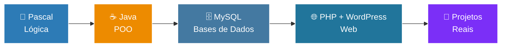

 <!-- ═══════════════════════════════════════════════════════
     TROQUE: SEU-USUARIO, SEU NOME, e os links/contactos
     Este ficheiro deve ficar num repositório com o MESMO nome
     do seu usuário (SEU-USUARIO/SEU-USUARIO) para aparecer no perfil.
     ═══════════════════════════════════════════════════════ -->

<div align="center">


<a href="https://git.io/typing-svg">
  
</a>

<br/>


</div>

---

## 👨‍💻 Sobre mim

```java
public class SeuNome {

    private String universidade = "Universidade Eduardo Mondlane (UEM)";
    private String linguagemPrincipal = "Java";
    private String[] tambemSei = {"Pascal"};
    private String[] ferramentas = {"NetBeans", "XAMPP", "MySQL Workbench", "phpMyAdmin", "PHP", "WordPress"};

    public String objetivo() {
        return "Tornar-me um desenvolvedor completo e criar soluções que fazem diferença 🚀";
    }

    public static void main(String[] args) {
        System.out.println("Sempre aprendendo, sempre evoluindo! 💜");
    }
}
```

- 🎓 Estudante na **Universidade Eduardo Mondlane (UEM)**
- ☕ Programo em **Java** — a minha linguagem principal
- 📚 Também tenho conhecimento em **Pascal**, onde dei os primeiros passos na lógica de programação
- 🌐 Crio sites com **WordPress**
- 🗄️ Trabalho com bases de dados **MySQL**
- 🌱 Atualmente a aprofundar Java, bases de dados e desenvolvimento web
- 💬 Pergunte-me sobre: Java, lógica de programação, WordPress e bases de dados
- 🤝 Aberto a colaborações, projetos académicos e a trocar conhecimento

---

## 🛠️ Linguagens e Ferramentas

### 💻 Linguagens

<div align="center">


</div>

### 🧰 Ferramentas

<div align="center">


</div>

---

## 🎓 Formação

<div align="center">

<table>
<tr>
<td align="center">

### 🏛️ Universidade Eduardo Mondlane
**UEM** — Moçambique 🇲🇿<br/>
*Estudante | Em formação*

</td>
</tr>
</table>

</div>

---

## 🗺️ Meu caminho de aprendizagem



<details>
<summary><b>🎯 Metas para os próximos meses</b></summary>
<br/>

- [ ] ☕ Dominar Programação Orientada a Objetos em Java
- [ ] 🔗 Aprender a ligar Java a MySQL (JDBC)
- [ ] 🌱 Estudar uma framework como Spring Boot
- [ ] 🌐 Aprofundar HTML, CSS e JavaScript
- [ ] 📂 Publicar mais projetos aqui no GitHub
- [ ] 🔀 Aprender Git e GitHub a fundo

</details>

---

## 📊 Estatísticas do GitHub

<div align="center">


<br/>


</div>

---

## 📂 Projetos em destaque

<div align="center">

<a href="https://github.com/SEU-USUARIO/NOME-DO-REPO-1">
  
</a>
<a href="https://github.com/SEU-USUARIO/NOME-DO-REPO-2">
  
</a>

</div>

> 💡 *Troque `NOME-DO-REPO-1` e `NOME-DO-REPO-2` pelos nomes dos seus repositórios reais.*

---

## 🤝 Vamos conversar?

<div align="center">

[](https://github.com/SEU-USUARIO)
[](https://linkedin.com/in/SEU-USUARIO)
[](https://wa.me/258SEUNUMERO)
[](https://instagram.com/SEU-USUARIO)
[](mailto:seu@email.com)

</div>

---

<div align="center">

### ⭐ *"O código é poesia escrita para máquinas e lida por humanos."*

**Feito com 💜 e muito ☕ por SEU NOME**


</div>
