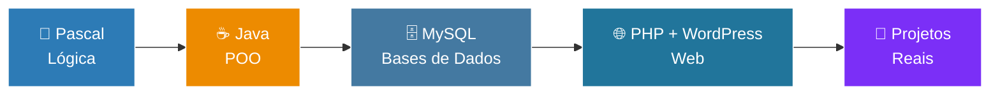

<div align="center">


<a href="https://git.io/typing-svg">
  
</a>

<br/><br/>


</div>

---

## 👨‍💻 Sobre mim

```java
public class Sizwe {

    private String universidade = "Universidade Eduardo Mondlane (UEM)";
    private String linguagemPrincipal = "Java";
    private String[] tambemSei = {"Pascal"};
    private String[] ferramentas = {"NetBeans", "XAMPP", "MySQL Workbench", "phpMyAdmin", "PHP", "WordPress"};

    public String objetivo() {
        return "Tornar-me um desenvolvedor completo e criar soluções que fazem diferença 🚀";
    }

    public static void main(String[] args) {
        System.out.println("Sempre aprendendo, sempre evoluindo! 💜");
    }
}
```

<div align="center">

<table>
<tr>
<td align="center" width="25%">

### 🎓
**Estudo na**<br/>UEM

</td>
<td align="center" width="25%">

### ☕
**Linguagem principal**<br/>Java

</td>
<td align="center" width="25%">

### 🌐
**Crio sites com**<br/>WordPress

</td>
<td align="center" width="25%">

### 🗄️
**Bases de dados**<br/>MySQL

</td>
</tr>
</table>

</div>

- 🌱 A aprofundar **Java**, **bases de dados** e **desenvolvimento web**
- 📚 Tenho conhecimento de **Pascal**, onde aprendi a base da lógica de programação
- 💬 Pergunte-me sobre: Java, lógica de programação, WordPress e MySQL
- 🤝 Aberto a colaborações, projetos académicos e troca de conhecimento

---

## 🛠️ Linguagens e Ferramentas

<div align="center">

### 💻 Linguagens


### 🧰 Ferramentas


</div>

---

## 🗺️ Meu caminho de aprendizagem



<details>
<summary><b>🎯 Metas para os próximos meses (clique para abrir)</b></summary>
<br/>

- [ ] ☕ Dominar Programação Orientada a Objetos em Java
- [ ] 🔗 Ligar Java a MySQL com JDBC
- [ ] 🌱 Estudar uma framework como Spring Boot
- [ ] 🌐 Aprofundar HTML, CSS e JavaScript
- [ ] 📂 Publicar mais projetos aqui no GitHub
- [ ] 🔀 Dominar Git e GitHub

</details>

---

## 📊 Estatísticas do GitHub

<div align="center">


<br/><br/>


<br/><br/>


</div>

---

## 🤝 Vamos conversar?

<div align="center">

[](https://github.com/sizwemassango-beep)

</div>

---

<div align="center">


<br/>

**Feito com 💜 e muito ☕ por Sizwe Arnaldo Massango**


</div>
