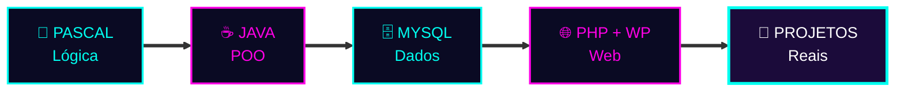

<div align="center">


<a href="https://git.io/typing-svg">
  
</a>

<br/>


</div>


## 🧬 `> cat sobre_mim.java`

```java
public class SeuNome {

    private String universidade = "Universidade Eduardo Mondlane (UEM)";
    private String linguagemPrincipal = "Java";
    private String[] tambemSei = {"Pascal"};
    private String[] ferramentas = {"NetBeans", "XAMPP", "MySQL Workbench", "phpMyAdmin", "PHP", "WordPress"};

    public String objetivo() {
        return "Tornar-me um desenvolvedor completo e criar soluções que fazem diferença 🚀";
    }

    public static void main(String[] args) {
        System.out.println("Sempre aprendendo, sempre evoluindo! 💜");
    }
}
```

## 🖥️ `> boot --sequence`

```bash
[ OK ] Carregando módulo ......... UEM_UNIVERSIDADE
[ OK ] Carregando módulo ......... JAVA_CORE
[ OK ] Carregando módulo ......... PASCAL_LOGICA
[ OK ] Carregando módulo ......... MYSQL_DATABASE
[ OK ] Carregando módulo ......... PHP_WORDPRESS
[ .. ] Carregando módulo ......... SPRING_BOOT      (em progresso)
[ .. ] Carregando módulo ......... WEB_FRONTEND     (em progresso)
[ -- ] Sistema pronto para colaborações e novos projetos
```


## ⚙️ `> ls /arsenal`

<div align="center">

### // LINGUAGENS


### // FERRAMENTAS


</div>

## 🛰️ `> route --aprendizagem`



<details>
<summary><b>🎯 MISSÕES ATIVAS (clique para abrir)</b></summary>
<br/>

- [ ] ☕ Dominar Programação Orientada a Objetos em Java
- [ ] 🔗 Ligar Java ao MySQL com JDBC
- [ ] 🌱 Estudar Spring Boot
- [ ] 🌐 Aprofundar HTML, CSS e JavaScript
- [ ] 📂 Publicar projetos aqui no GitHub
- [ ] 🔀 Dominar Git e GitHub

</details>


## 📡 `> stats --github`

<div align="center">


<br/><br/>


<br/><br/>


</div>


## 📶 `> contact --open`

<div align="center">

[](https://github.com/sizwemassango-beep)

<br/>


<br/>

**`> fim_da_transmissão` &nbsp;|&nbsp; Feito com 💜 e muito ☕ por Sizwe Arnaldo Massango**


</div>
